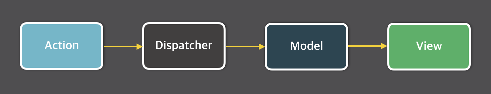
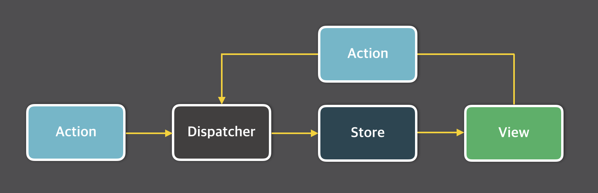

# Redux Middleware Tutorial

React Application 에서 State Management 의 꽃인 Redux 를 더욱 심도 있게 공부하기 위한 저장소입니다.

서버로 요청한 작업을 클라이언트에서 비동기 방식으로 두고 진행하기 위해 비동기 요청을 관리하는 Middleware 인 Redux Thunk, Redux Saga 를 다뤄 보겠습니다.

현재까지 Redux 만 이용하는 방법은 동기 방식으로 불러와서 사용하였습니다.

실제로 서버와 클라이언트 사이의 연동이 불안한 경우의 시나리오를 풀어 나가는 목적으로 이 저장소를 생성하였습니다.

Redux 에 대하여 좋은 아이디어가 있으신 분은 Issues 에 남겨주시면 감사하겠습니다!

## What Is Redux?


JavaScript Application 에서 컴포넌트의 생명 주기 함수에 따라 동작하는 State 등의 변수가 있습니다. 이를 컴포넌트 변수로 부르겠습니다. (React.js 를 기준으로) 

서버와 클라이언트 측의 간단한 요청들은 MVC 구조로도 충분합니다. 


규모가 작은 Application 에서 컴포넌트 변수를 관리하는 것은 식은 죽 먹기지만, 점차 커지는 Application 에서 이를 관리하는 것은 귀찮아집니다.

귀찮다는 의미는 겨우 데이터를 관리하는 일에 많은 비중의 소스 코드의 양을 차지하여 이를 일일히 수정하는 과정이 까다로워집니다. 이를 스파게티 코드라고 부릅니다.



이를 방지하기 위해 규모가 큰 Application 에서는 공통으로 사용하는 데이터에 대하여 한 번에 불러오고 사용하기 위한 개념이 필요합니다. 이를 State Management 라고 칭하겠습니다. 

State Management 의 대표적인 구조는 Flux 구조인데, 이는 Facebook 에서 최초로 발표하였습니다.

MVC 구조와 다르게 단방향으로 데이터가 흐릅니다. 이 뜻은 데이터의 흐름이 Dispatcher 에서 Store, Store 에서 View, View 에서 Action 으로, 다시 Action 에서 Dispatcher 로 넘어 가는 것입니다. 

View 단에서 새로운 요청이 들어오면 아래 사진과 같이 재구성 됩니다.



양방향 데이터 바인딩 과정에서는 Model 에 따른 순차적인 업데이트 과정이 필요하였으나, Flux 를 이용한 데이터 변화를 더욱 쉽게 알아 차리게끔 도와줍니다.

State Management Library 는 대표적으로 Redux, MobX 등이 있습니다. Flux 구조를 완벽하게 구현한 프레임워크는 아직 안 나왔습니다. 

그렇지만 Redux 는 Flux 구조를 따르기 위한 노력이 엿보였으며, 약간 단순했어도 JavaScript 버전에 따른 지원과 Library 의 용량이 2KB 정도로 상당히 작은 면에서 많은 칭송을 받았습니다.

## Flux Elements

Flux 를 이루는 3요소는 Dispatcher, Store, Action 이 있고, MVC 패턴의 View 를 약간 다르게 사용합니다.

- Dispatcher
    
    - Flux 구조로 돌아가는 Application 의 모든 데이터 흐름을 관리하는 역할을 합니다. 
    
   -  Action 이 발생하면, Dispatcher 에 등재된 콜백 함수를 이용하여 Store 에 전달을 합니다. 

    - 이는 전체 Application 에서 오로지 1개의 인스턴스만 사용합니다.

- Action
  
    - Dispatcher 의 특정 함수를 실행하면 Store 측에 변화가 일어나는데, 여기서 필요한 데이터의 묶음을 전달하는 역할을 합니다.

    - Action 은 각각 다르게 고유 ID 나 Type, Payload 로 나뉘게 됩니다. 아래와 같은 함수를 사례로, 클라이언트에서 서버로 모든 인원 목록에 대해 가져오는 AJAX 요청을 Payload 로 지정하고, Action 타입은 `FETCH_ALL_PERSON` 으로 지정합니다. 이에 따른 성공과 실패 여부를 Payload 인 Request 값에 따라 다른 Action 으로 구분 짓고 각 다른 Type, Payload 를 만들어 나가는 방식입니다.

    ```
    export function fetch_all_person() {
        const request = axios.get('http://person.io/all_person');
        return {
            action : 'FETCH_ALL_PERSON',
            payload : request
        }
    }
    ```

    - Action 은 Dispatcher 를 사용하여 전달 되어야 합니다. 그리고 Flux 구조로 만들어진 Container 에는 각 Action 별로 생성자를 형성해 Dispatcher 로 보내줍니다.
  
- Store
    
    - Application 의 State 를 저장을 하는데, MVC 구조의 Model 과 유사하지만, ORM 으로 구성된 데이터가 아닌 특정 Domain 에 해당 되는 State 를 다룹니다.

    - 오로지 State 만 다뤄 서버 단으로 요청하는 비동기 동작은 Action 측에서 처리해야 합니다.(예를 들어 Axios 모듈을 이용한 AJAX 처리)

    - Store 는 오로지 State 만 담아주는 쇼핑 카트와 같은 역할을 합니다.
  
- View

    - MVC 패턴의 View 와 전혀 다른 점이 화면을 표시하는 것을 부모와 자식으로 배분하는 역할을 지니고 있어 Controller-View 로 이해하시는 것이 좋습니다.
  
    - View 에서는 Store 에 따른 변경 사항을 감지하는 이벤트 리스너 등록, 이에 따른 결과를 반영시키는 것이 전부입니다.

## Redux Elements

Redux 의 구성은 Flux 와 거의 유사하여 위의 요소들은 큰 설명 없이 넘어가겠습니다. 그렇지만 Flux 패턴에 유일하게 없는 요소가 바로 Reducer 입니다. 이에 대한 설명은 아래에 후술하겠습니다.

- Reducer
    
    - Action 에서는 어떤 일이 일어났는지 Type 으로 구분 짓지만, State 별로 어떻게 바꿔야 하는지 알려주지 않습니다. 이를 위해 Store 객체를 업데이트 하는 콜백 함수의 역할을 Redux 에서 이 요소가 대신 처리합니다. (사항에 따라 Updater 로 바꾸는 것이 더욱 낫다는 이야기도 있긴 합니다.)

    - Reducer 를 작성할 때 다음과 같은 사항을 지켜야 합니다.

        1. 처음 인수로 전달 받은 State 는 수정하면 안 되고, Object.assign() 함수 등을 이용해서 새로운 객체를 만들어 반환하는 것을 권장합니다.
        
        2. default 케이스에서 기존 state 를 리듀서에서 처리하지 못하는 경우를 대비하여 **그대로** 반환합니다. 

    - Reducer 는 대부분 switch 문으로 작성하고, `combineReducers` 함수를 사용하여 Application 에서 사용하는 모든 Reducer 를 한 번에 묶을 수 있어 편리합니다.

## Redux-Thunk

- 공부하면서 작성 하겠습니다.
  
## Redux-Saga

- 공부하면서 작성 하겠습니다.

## About Project

이 토이 프로젝트의 목표는 Redux-Thunk 와 Redux-Saga 를 사용하여 간단한 게시판 기능을 구현하는 것입니다.

게시판 API 는 django REST Framework 를 사용했습니다.


## Author

- 강인성([tails5555](https://github.com/tails5555))

## References

- MVC 구조과 Flux 구조의 차이, 그리고 Redux (http://webframeworks.kr/tutorials/react/flux/)

- Flux 구조에 대한 Facebook 강연 참조(https://haruair.github.io/flux/docs/overview.html)

- React + Redux 소개 (https://d2.naver.com/helloworld/1848131)